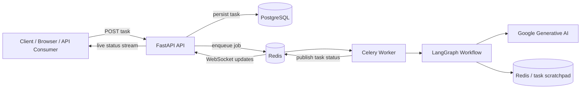
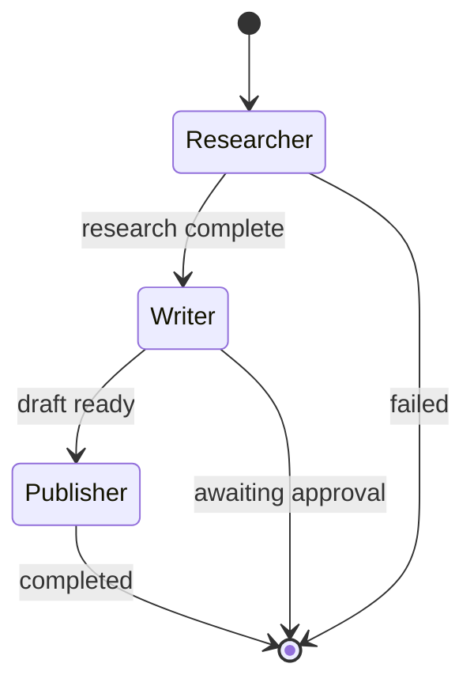
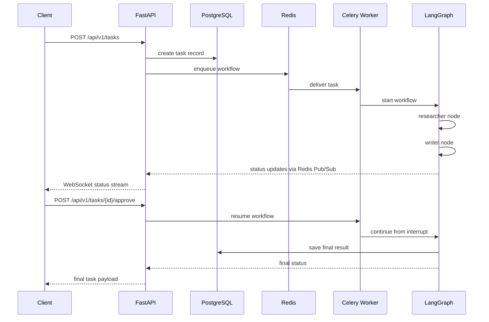

# Collaborative AI Agent Orchestration

A small orchestration project built with FastAPI, SQLAlchemy, Celery, Redis, PostgreSQL, and LangGraph. The goal is to process a user prompt asynchronously, allow a human approval checkpoint, and stream task status updates in real time.

This repository demonstrates a practical pattern for separating the API layer from long-running AI workflow execution, while persisting task state in a database and publishing progress over WebSockets.

## Overview

The application accepts a task request, saves it to PostgreSQL, dispatches a Celery worker, and executes a LangGraph workflow in the background. The workflow can pause before the publishing step and wait for approval before finalizing the result.

The app is organized around a simple idea:

- FastAPI handles inbound HTTP and WebSocket traffic
- PostgreSQL stores the source of truth for every task
- Redis is used for broker/backend state and Pub/Sub status broadcasting
- Celery runs the long-running workflow outside the request lifecycle
- LangGraph coordinates the agent steps

## Architecture



### Main runtime flow

1. A client submits a task through the FastAPI API.
2. The task is inserted into the `tasks` table.
3. A Celery task is triggered to run the workflow asynchronously.
4. The worker updates task status and executes the LangGraph pipeline.
5. The workflow can interrupt before publishing, waiting for approval.
6. Once approved, the resume step continues and the final output is saved back to the database.

## Tech stack

- FastAPI for the HTTP API and WebSocket endpoints
- SQLAlchemy AsyncIO and PostgreSQL for persistence
- Celery and Redis for background jobs and status propagation
- LangGraph for workflow orchestration
- Google Generative AI for LLM-based generation
- Docker Compose for local service orchestration

## Agent collaboration

The workflow is built in LangGraph and currently includes three main stages:

- `researcher`: gathers the input data or simulated research output
- `writer`: produces the draft based on the prompt and research
- `publisher`: finalizes the task after approval

The graph is configured to interrupt before the publisher step, which creates the human-in-the-loop checkpoint.



### Workflow behavior



## Repository layout

```text
.
├── docker-compose.yaml
├── Dockerfile
├── requirements.txt
├── .env.example
├── README.md
├── Challenges.md
├── src/
│   ├── main.py
│   ├── api/
│   │   ├── schemas.py
│   │   └── tasks.py
│   ├── agents/
│   │   ├── graph.py
│   │   ├── nodes.py
│   │   ├── scratchpad.py
│   │   ├── state.py
│   │   └── tools.py
│   ├── db/
│   │   ├── database.py
│   │   └── models.py
│   ├── logs/
│   │   └── logger.py
│   └── worker/
│       ├── celery_app.py
│       └── tasks.py
└── logs/
```

## Core data model

The primary persistence model is the `Task` entity in `src/db/models.py`.

```python
class Task(Base):
    __tablename__ = "tasks"

    id = Column(UUID(as_uuid=True), primary_key=True, default=uuid.uuid4)
    prompt = Column(Text, nullable=False)
    status = Column(String(50), nullable=False, default="PENDING")
    result = Column(Text, nullable=True)
    agent_logs = Column(JSONB, nullable=True)
    created_at = Column(DateTime(timezone=True), server_default=func.now(), nullable=False)
    updated_at = Column(DateTime(timezone=True), server_default=func.now(), onupdate=func.now(), nullable=False)
```

This table keeps the task lifecycle simple and explicit:

- `PENDING`
- `RUNNING`
- `AWAITING_APPROVAL`
- `RESUMED`
- `COMPLETED`
- `FAILED`

## API surface

The API is defined in `src/api/tasks.py`.

### Health check

```bash
GET /health
```

Returns:

```json
{
  "status": "healthy",
  "service": "api"
}
```

### Create task

```bash
POST /api/v1/tasks
```

Request body:

```json
{
  "prompt": "Explain how this orchestration workflow works"
}
```

### Get task state

```bash
GET /api/v1/tasks/{task_id}
```

### Approve task

```bash
POST /api/v1/tasks/{task_id}/approve
```

Request body:

```json
{
  "approved": true,
  "feedback": "Proceed with the final publish step."
}
```

### WebSocket status stream

```bash
ws://localhost:8000/api/v1/tasks/{task_id}
```

The WebSocket subscribes to a Redis Pub/Sub channel and streams status changes such as `RUNNING` or `COMPLETED`.

## Local setup

### Prerequisites

- Docker and Docker Compose
- Python 3.10+ (for local dev outside containers)
- A valid Google Generative AI API key if you want the LLM-based node to run fully

### 1. Configure environment

Copy the example environment file and update the values:

```bash
cp .env.example .env
```

Example values:

```env
POSTGRES_USER=user
POSTGRES_DB=DB_Agent
POSTGRES_PASSWORD=your_password
DATABASE_URL=postgresql+asyncpg://user:your_password@db:5432/DB_Agent
REDIS_URL=redis://redis:6379/0
LLM_API_KEY="your_key_here"
CELERY_BROKER_URL="redis://redis:6379/1"
CELERY_RESULT_BACKEND="redis://redis:6379/2"
API_PORT="8000"
```

### 2. Start the stack

```bash
docker-compose up --build -d
```

This starts:

- PostgreSQL on port `5432`
- Redis on port `6379`
- FastAPI on port `8000`
- Celery worker process

### 3. Verify the API

```bash
curl http://localhost:8000/health
```

Expected response:

```json
{
  "status": "healthy",
  "service": "api"
}
```

### 4. Create a task

```bash
curl -X POST http://localhost:8000/api/v1/tasks \
  -H "Content-Type: application/json" \
  -d '{"prompt": "Explain the benefits of agent orchestration for asynchronous workflows."}'
```

### 5. Approve the task

Once the task reaches the approval checkpoint, continue with:

```bash
curl -X POST http://localhost:8000/api/v1/tasks/{task_id}/approve \
  -H "Content-Type: application/json" \
  -d '{"approved": true, "feedback": "Proceed to final publish."}'
```

### 6. Fetch the final result

```bash
curl http://localhost:8000/api/v1/tasks/{task_id}
```

## Notes

The key design decision is to keep FastAPI lightweight while shifting computationally intensive or long-running AI work into Celery and LangGraph workers.

